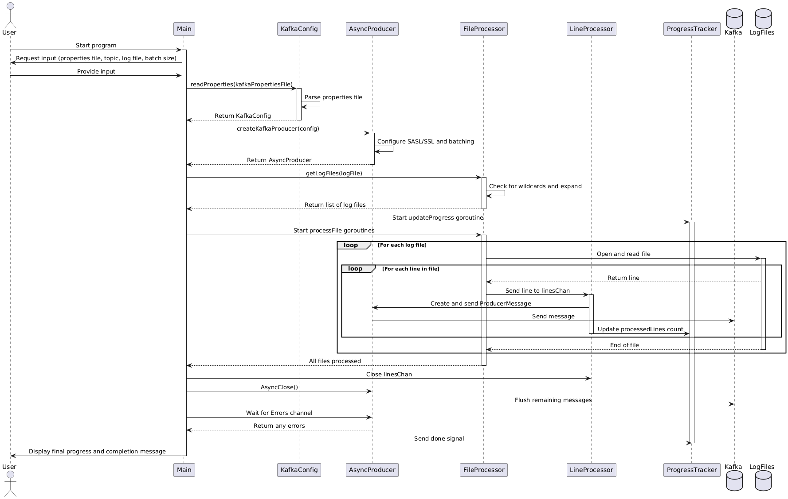
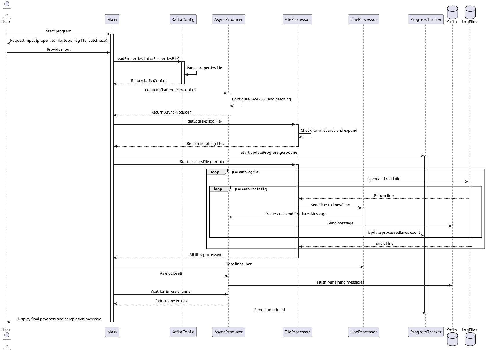
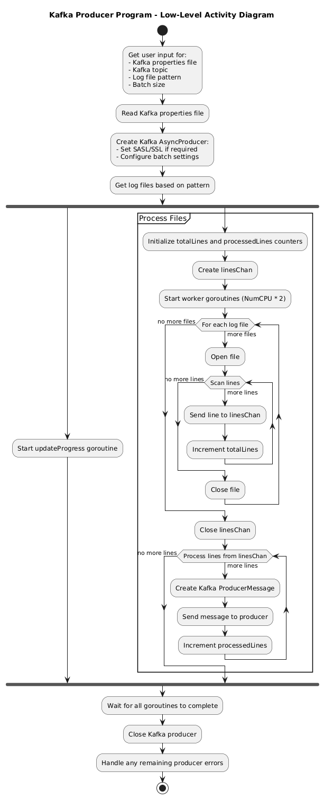
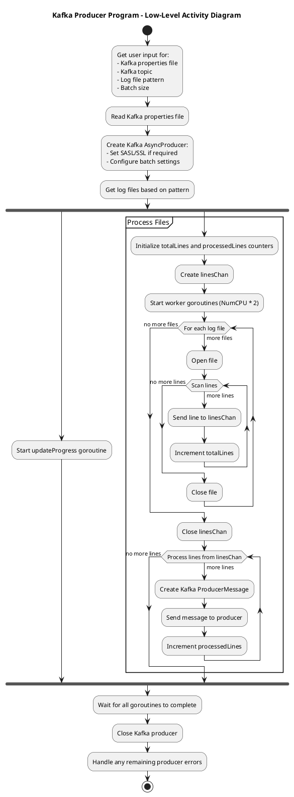
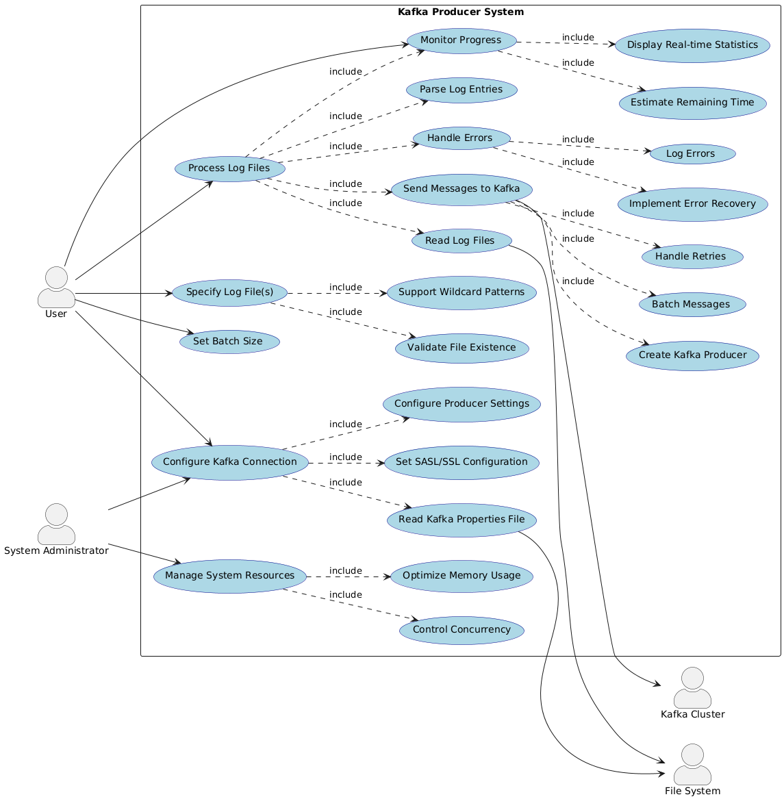
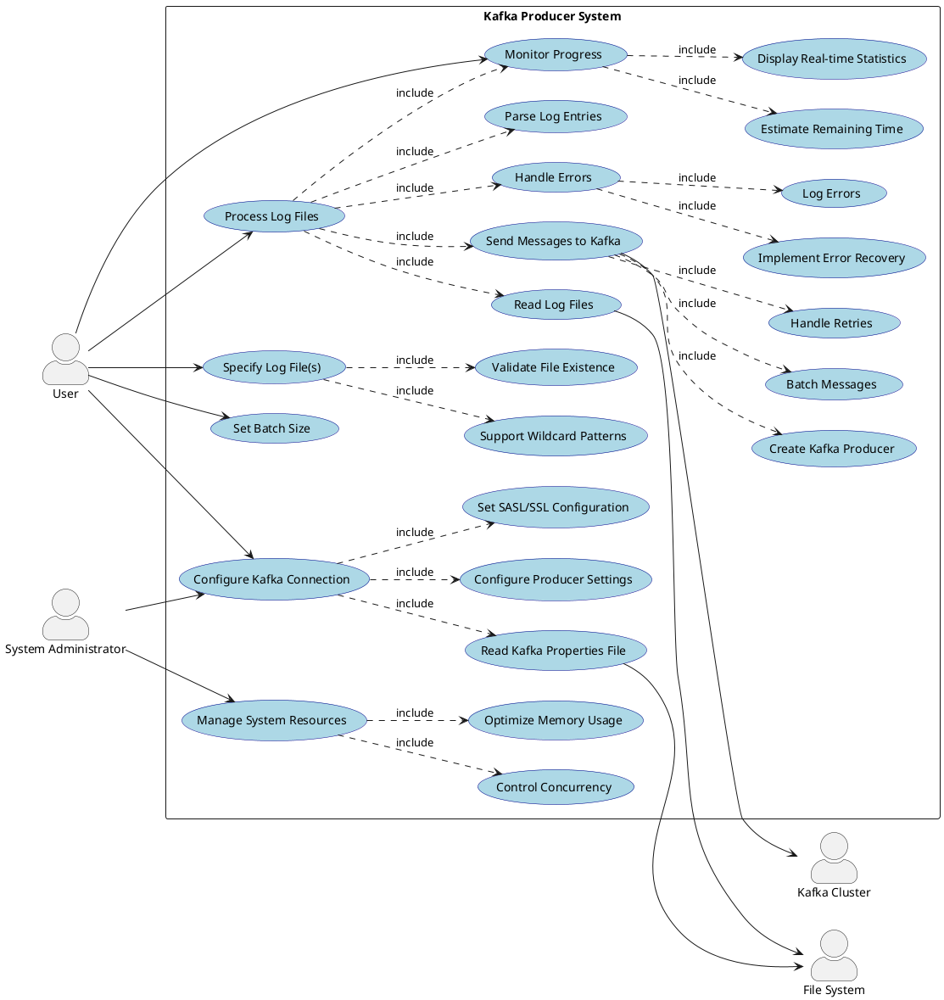
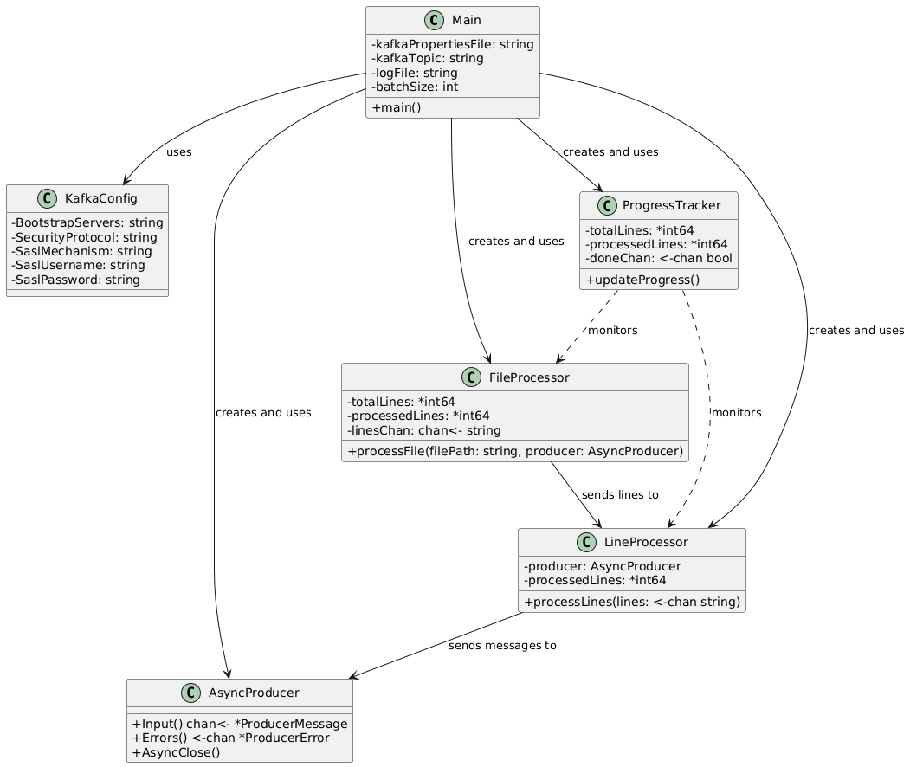
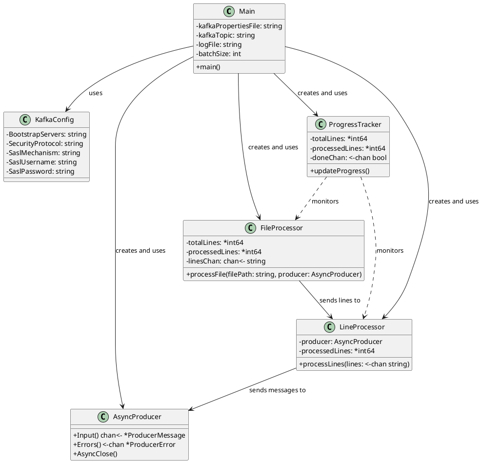

# โปรแกรม Kafka producer

## [plantUML render here..](https://plantuml.ipv9.me)

- Sequence Diagram: Diagram นี้แสดงการโต้ตอบระหว่างส่วนประกอบต่าง ๆ ของโปรแกรมอย่างละเอียด รวมถึงการทำงานแบบ concurrent ผ่าน goroutines และ channels 

คำอธิบายสำหรับ Sequence Diagram นี้:

1. User เริ่มโปรแกรมและให้ข้อมูลนำเข้าที่จำเป็น

2. Main อ่านไฟล์ properties ผ่าน KafkaConfig

3. Main สร้าง AsyncProducer โดยใช้การตั้งค่าที่อ่านมา

4. Main ค้นหาไฟล์ log ที่ต้องประมวลผลผ่าน FileProcessor

5. Main เริ่ม goroutine สำหรับ ProgressTracker เพื่อติดตามความคืบหน้า

6. Main เริ่ม goroutines สำหรับ FileProcessor เพื่อประมวลผลไฟล์:
   - FileProcessor อ่านแต่ละไฟล์
   - สำหรับแต่ละบรรทัด, ส่งไปยัง LineProcessor ผ่าน channel
   - LineProcessor สร้างและส่ง ProducerMessage ไปยัง AsyncProducer
   - AsyncProducer ส่งข้อความไปยัง Kafka
   - LineProcessor อัปเดตจำนวนบรรทัดที่ประมวลผลใน ProgressTracker

7. เมื่อประมวลผลไฟล์ทั้งหมดเสร็จ, Main ปิด linesChan

8. Main เรียก AsyncClose บน Producer เพื่อส่งข้อความที่เหลือ

9. Main รอและจัดการข้อผิดพลาดจาก Producer

10. Main ส่งสัญญาณ "done" ไปยัง ProgressTracker

11. Main แสดงข้อความสรุปและเสร็จสิ้นโปรแกรม

  
---
- Activity Diagram: Diagram นี้แสดงรายละเอียดการทำงานในระดับที่ลึกขึ้น รวมถึงการใช้ goroutines, channels, และการประมวลผลแบบขนาน ซึ่งเป็นลักษณะสำคัญของโปรแกรม Go 

คำอธิบาย:

1. เริ่มต้นด้วยการรับข้อมูลจากผู้ใช้สำหรับการตั้งค่าต่าง ๆ
2. อ่านไฟล์ properties ของ Kafka
3. สร้าง Kafka AsyncProducer พร้อมกับตั้งค่า SASL/SSL และการ batch
4. ค้นหาไฟล์ log ตามรูปแบบที่ระบุ
5. แยกการทำงานเป็นสองส่วนแบบขนาน:
   a. เริ่ม goroutine สำหรับอัปเดตความคืบหน้า
   b. ประมวลผลไฟล์:
      - เตรียมตัวนับและช่องสำหรับส่งข้อมูล
      - เริ่ม worker goroutines
      - วนลูปอ่านแต่ละไฟล์และส่งแต่ละบรรทัดไปยังช่อง
      - ประมวลผลบรรทัดจากช่องและส่งไปยัง Kafka producer
6. รอให้ goroutines ทั้งหมดทำงานเสร็จ
7. ปิด Kafka producer
8. จัดการข้อผิดพลาดที่อาจเหลืออยู่จาก producer

---
- Use Case Diagram: Diagram นี้ให้ภาพรวมที่ละเอียดมากขึ้นของระบบ Kafka Producer โดยแสดงให้เห็นถึง:
  - กรณีการใช้งานย่อยที่ประกอบกันเป็นฟังก์ชันการทำงานหลัก
  - ความสัมพันธ์ที่ซับซ้อนระหว่าง Use Cases ต่าง ๆ
  - การปฏิสัมพันธ์กับระบบภายนอก (Kafka Cluster และ File System)
  - บทบาทที่แตกต่างกันของ User และ System Administrator 

คำอธิบายสำหรับ Use Case Diagram:

1. Actors (ผู้กระทำ):
   - User: ผู้ใช้งานทั่วไปของโปรแกรม
   - System Administrator: ผู้ดูแลระบบที่มีสิทธิ์ในการกำหนดค่าขั้นสูง
   - Kafka Cluster: ระบบ Kafka ที่รับข้อความ
   - File System: ระบบไฟล์ที่เก็บ log files และ configuration files

2. Use Cases หลัก (กรณีการใช้งานหลัก):
   - Configure Kafka Connection (UC1)
   - Specify Log File(s) (UC2)
   - Set Batch Size (UC3)
   - Process Log Files (UC4)
   - Send Messages to Kafka (UC5)
   - Monitor Progress (UC6)
   - Handle Errors (UC7)
   - Manage System Resources (UC8)

3. Use Cases ย่อย (กรณีการใช้งานย่อย):
   สำหรับแต่ละ Use Case หลัก มีการแยกย่อยเป็น Use Cases ที่เฉพาะเจาะจงมากขึ้น เช่น:
   - UC1 แยกเป็น Read Kafka Properties File, Set SASL/SSL Configuration, Configure Producer Settings
   - UC4 แยกเป็น Read Log Files, Parse Log Entries
   - UC5 แยกเป็น Create Kafka Producer, Batch Messages, Handle Retries
   - และอื่น ๆ

4. ความสัมพันธ์:
   - ใช้ความสัมพันธ์แบบ "include" เพื่อแสดงว่า Use Case หลักประกอบด้วย Use Cases ย่อย
   - แสดงการปฏิสัมพันธ์ระหว่าง Use Cases กับ Actors ภายนอกระบบ เช่น Kafka Cluster และ File System

5. รายละเอียดเพิ่มเติม:
   - แสดงให้เห็นว่า System Administrator มีบทบาทในการกำหนดค่าการเชื่อมต่อ Kafka และจัดการทรัพยากรระบบ
   - เพิ่ม Use Case สำหรับการจัดการทรัพยากรระบบ (UC8) ซึ่งรวมถึงการควบคุม concurrency และการใช้หน่วยความจำ

---
- Class Diagram: Diagram นี้แสดงให้เห็นโครงสร้างและความสัมพันธ์ระหว่างคลาสต่าง ๆ ในโปรแกรม ช่วยให้เข้าใจการออกแบบและการแบ่งความรับผิดชอบของแต่ละส่วนในระบบ แสดงโครงสร้างของคลาสและความสัมพันธ์ระหว่างคลาสต่าง ๆ ที่สำคัญในโปรแกรม

คำอธิบายสำหรับ Class Diagram นี้:

1. Main: คลาสหลักที่ควบคุมการทำงานของโปรแกรม
   - มีฟิลด์สำหรับเก็บค่าการตั้งค่าต่าง ๆ
   - มีเมธอด main() ที่เป็นจุดเริ่มต้นของโปรแกรม

2. KafkaConfig: คลาสที่เก็บการตั้งค่าสำหรับการเชื่อมต่อ Kafka
   - มีฟิลด์สำหรับเก็บค่าการตั้งค่าต่าง ๆ ของ Kafka

3. AsyncProducer: อินเตอร์เฟซที่แทน Kafka AsyncProducer
   - มีเมธอดสำหรับส่งข้อความและจัดการข้อผิดพลาด

4. FileProcessor: คลาสที่จัดการการอ่านไฟล์
   - มีฟิลด์สำหรับเก็บค่าตัวนับและช่องสำหรับส่งบรรทัด
   - มีเมธอด processFile() สำหรับประมวลผลไฟล์

5. LineProcessor: คลาสที่จัดการการประมวลผลแต่ละบรรทัด
   - มีฟิลด์สำหรับ producer และตัวนับบรรทัดที่ประมวลผลแล้ว
   - มีเมธอด processLines() สำหรับประมวลผลบรรทัดและส่งไปยัง Kafka

6. ProgressTracker: คลาสที่ติดตามและแสดงความคืบหน้า
   - มีฟิลด์สำหรับตัวนับและช่องสัญญาณ
   - มีเมธอด updateProgress() สำหรับอัปเดตและแสดงความคืบหน้า

ความสัมพันธ์ระหว่างคลาส:
- Main ใช้งานคลาสอื่น ๆ ทั้งหมด
- FileProcessor ส่งข้อมูลไปยัง LineProcessor
- LineProcessor ส่งข้อความไปยัง AsyncProducer
- ProgressTracker ติดตามความคืบหน้าของ FileProcessor และ LineProcessor

---
