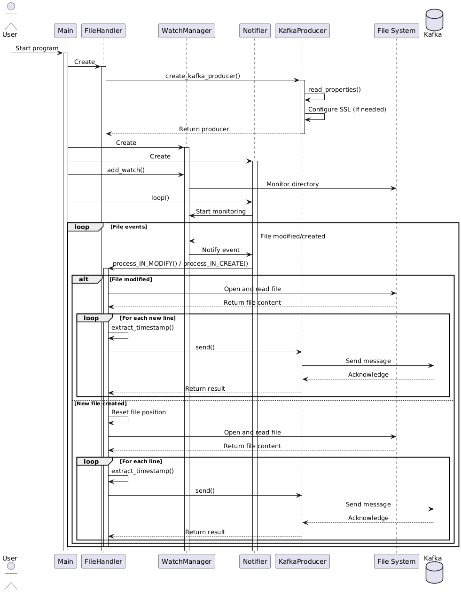
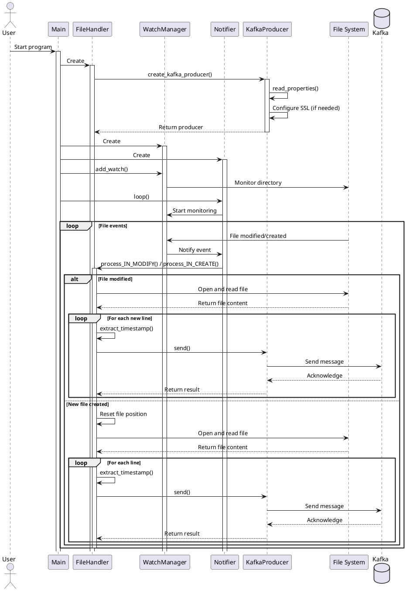
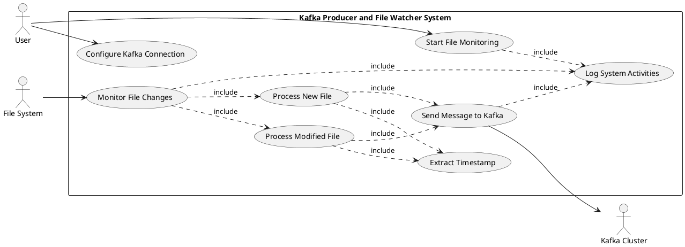
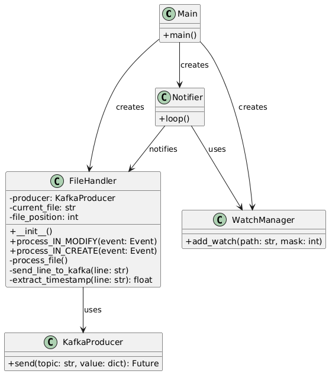
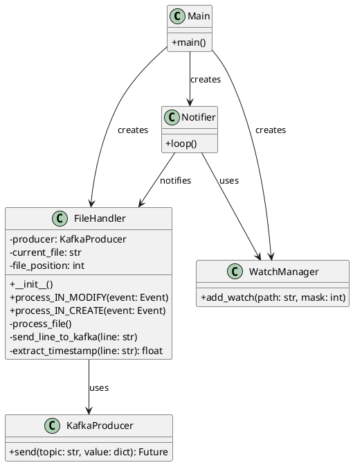
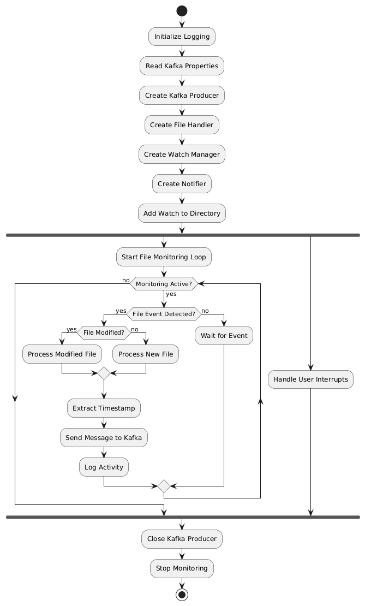
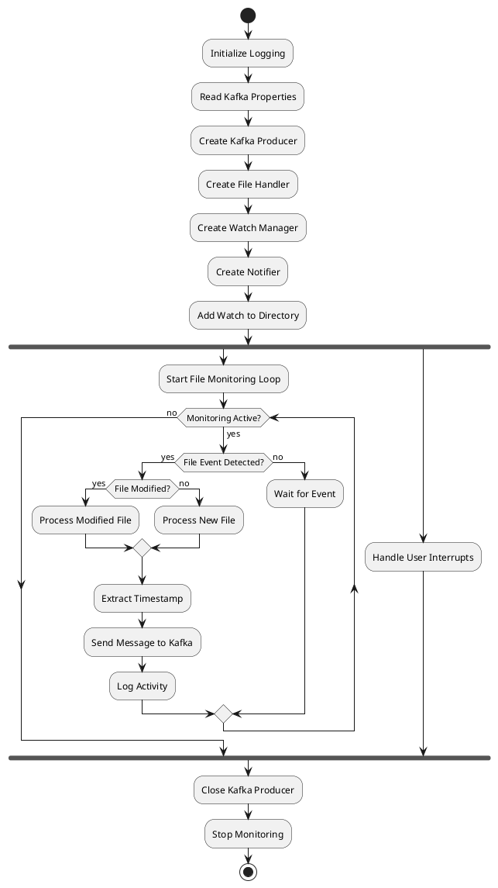

# โปรแกรม Kafka Producer และ File Watcher
--- 
> copy โค๊ดด้านล่างของรูป ขยายที่ [plantUML render](https://plantuml.ipv9.me) เพื่อตวามชัดเจนของรูปได้
---
### Kafka Producer and File watcher

คำอธิบาย:
โปรแกรม Kafka Producer นี้เขียนด้วยภาษา Python เป็นระบบติดตามการเปลี่ยนแปลงของไฟล์ log แบบ real-time โดยใช้ pyinotify และส่งข้อมูลไปยัง Kafka cluster โปรแกรมรองรับการเชื่อมต่อแบบ SASL/SSL กับ Kafka และมีการจัดการ timestamp ของข้อมูลอย่างเหมาะสม

Features:

1. การติดตามไฟล์แบบ Real-time:
   ใช้ pyinotify เพื่อติดตามการเปลี่ยนแปลงของไฟล์ log แบบ real-time สามารถตรวจจับทั้งการแก้ไขไฟล์และการสร้างไฟล์ใหม่ ทำให้สามารถประมวลผลข้อมูลได้ทันทีที่มีการเปลี่ยนแปลง

2. การรักษาความปลอดภัยและการกำหนดค่าแบบยืดหยุ่น:
   รองรับการเชื่อมต่อ Kafka แบบ SASL/SSL และสามารถอ่านการตั้งค่าจากไฟล์ properties ทำให้สามารถปรับแต่งการเชื่อมต่อและการรักษาความปลอดภัยได้โดยไม่ต้องแก้ไขโค้ด

3. การจัดการ Timestamp และโครงสร้างข้อมูล:
   มีการแยก timestamp จากข้อมูล log และสร้างโครงสร้างข้อมูลที่เหมาะสมก่อนส่งไปยัง Kafka โดยรวมชื่อไฟล์, เนื้อหา, และ timestamp ไว้ในข้อความเดียวกัน ช่วยให้การวิเคราะห์และประมวลผลข้อมูลในภายหลังทำได้สะดวกยิ่งขึ้น

---
### Sequence Diagram 
- Diagram นี้แสดงให้เห็นการทำงานแบบต่อเนื่องของระบบในการติดตามการเปลี่ยนแปลงของไฟล์และส่งข้อมูลไปยัง Kafka โดยเฉพาะ:
  - การสร้างและกำหนดค่า KafkaProducer
  - การติดตามการเปลี่ยนแปลงของไฟล์ด้วย pyinotify
  - การจัดการกับเหตุการณ์การแก้ไขไฟล์และการสร้างไฟล์ใหม่
  - กระบวนการอ่านไฟล์และส่งข้อมูลไปยัง Kafka

คำอธิบายสำหรับ Sequence Diagram นี้:

1. User เริ่มโปรแกรม

2. Main สร้าง FileHandler:
   - FileHandler สร้าง KafkaProducer โดยเรียกใช้ create_kafka_producer()
   - KafkaProducer อ่านค่าจากไฟล์ properties และกำหนดค่า SSL ถ้าจำเป็น

3. Main สร้าง WatchManager และ Notifier

4. Main เพิ่มการติดตามไดเรกทอรีที่ต้องการผ่าน WatchManager

5. Main เริ่ม loop ของ Notifier เพื่อเริ่มการติดตามไฟล์

6. เมื่อมีเหตุการณ์เกิดขึ้นกับไฟล์ (แก้ไขหรือสร้างใหม่):
   - FileSystem แจ้ง WatchManager
   - WatchManager แจ้ง Notifier
   - Notifier เรียก process_IN_MODIFY() หรือ process_IN_CREATE() ของ FileHandler

7. FileHandler ดำเนินการตามประเภทของเหตุการณ์:
   - ถ้าไฟล์ถูกแก้ไข: อ่านเฉพาะส่วนใหม่ของไฟล์
   - ถ้าไฟล์ถูกสร้างใหม่: รีเซ็ตตำแหน่งการอ่านและอ่านไฟล์ทั้งหมด

8. สำหรับแต่ละบรรทัดที่อ่านได้:
   - FileHandler แยกข้อมูล timestamp
   - FileHandler ส่งข้อความไปยัง KafkaProducer
   - KafkaProducer ส่งข้อความไปยัง Kafka
   - Kafka ตอบกลับเพื่อยืนยันการรับข้อความ

---

### Use Case Diagram, Class Diagram, และ Activity Diagram 

#### Use Case Diagram:
- diagrams เหล่านี้ช่วยให้เห็นภาพรวมของระบบในมุมมองที่แตกต่างกัน ทั้งด้านฟังก์ชันการทำงาน, โครงสร้าง, และลำดับการทำงาน

#### Class Diagram:

#### Activity Diagram:

คำอธิบายสำหรับแต่ละ diagram:

1. Use Case Diagram:
   - แสดงการปฏิสัมพันธ์ระหว่างผู้ใช้, ระบบไฟล์, และ Kafka Cluster กับระบบ
   - ระบุ use cases หลัก เช่น การเริ่มการติดตามไฟล์, การกำหนดค่าการเชื่อมต่อ Kafka, และการประมวลผลไฟล์

2. Class Diagram:
   - แสดงโครงสร้างของคลาสหลักในระบบ ได้แก่ Main, FileHandler, KafkaProducer, WatchManager, และ Notifier
   - แสดงความสัมพันธ์ระหว่างคลาส เช่น การสร้างและการใช้งาน

3. Activity Diagram:
   - แสดงลำดับขั้นตอนการทำงานของระบบ ตั้งแต่การเริ่มต้นจนถึงการสิ้นสุดการทำงาน
   - รวมถึงการทำงานแบบขนาน (parallel) สำหรับการติดตามไฟล์และการจัดการการหยุดทำงานจากผู้ใช้

---